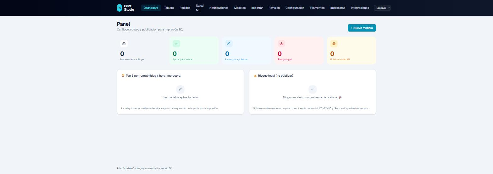

<!-- "Print Studio" is a placeholder brand name: it's fully customizable (white-label) in the /setup
     wizard, with no code changes. Rename it freely. -->
# Print Studio — 3D printing catalog, costing & selling

[](LICENSE)

[](https://print-studio-sable.vercel.app)

Open-source web platform to run an **on-demand 3D printing** business: import models, compute their real
**cost & pricing**, manage **legal risk (IP + license)** with a 🟢🟡🔴 traffic light, publish to
**marketplaces (Mercado Libre)** with AI-generated descriptions, and monitor listing **health** — all
operable by a non-technical person, from the browser or a bot.

✨ **White-label out of the box:** on first run, a wizard (`/setup`) lets you set your **name, logo and
colors** — by hand or **generated with AI** (fal.ai, OpenAI or Claude, with your own token). No code changes.

🔗 **Live demo:** https://print-studio-sable.vercel.app

> ⚠️ This repository contains **only the software**. It does **not** include 3D models, meshes, or catalog
> images. Not affiliated with Mercado Libre, BambuLab/MakerWorld, or any trademark mentioned.

## Deploy your own

[](https://vercel.com/new/clone?repository-url=https%3A%2F%2Fgithub.com%2Fgeronimoglez%2Fprint-studio&project-name=print-studio&repository-name=print-studio&stores=%5B%7B%22type%22%3A%22postgres%22%7D%2C%7B%22type%22%3A%22blob%22%7D%5D)

The button provisions a **Postgres** database and a **Blob** store automatically, and the build applies the
DB migrations for you — so the first deploy lands on the `/setup` wizard with nothing else to configure.

## What it does

- **Catalog + live costing.** Each model computes cost (filament + power + depreciation + labor +
  post-processing + failure rate), price (markup + marketplace fee + shipping), margin and **profit per
  printer-hour**. Changing the config recalculates the whole catalog.
- **Legal-risk traffic light (the core).** Layer 1 — **IP**: is it a third-party brand/character? (by name
  in `lib/riesgo.ts` and by **vision** with a VLM). Layer 2 — file **license** (`lib/licencias.ts`).
  Combined: 🟢 clean + commercial license · 🟡 clean, restricted license · 🔴 brand/IP (blocked, fail-closed).
- **Marketplace publishing** with auto-attributes, category prediction, photos/video, and AI sales copy.
- **Batch approval**, **listing health** dashboard, **self-serve importer**.
- **White-label branding** + AI setup assistant (BYOK).

## Stack

| Layer | Tech |
|---|---|
| Web + API | **Next.js 16** (App Router, Server Actions) |
| Data | **Prisma 7** (driver adapter `pg`) + **PostgreSQL** |
| Assets | **Vercel Blob** or **local filesystem** (`public/`) — interchangeable |
| AI / Vision | **OpenRouter / OpenAI / Anthropic** (text) · **fal.ai / OpenAI** (images) — all optional |
| Marketplace | **Mercado Libre API** |
| Bot | external HTTP gateway (`x-bot-key` header) — see [`docs/BOT_API.md`](./docs/BOT_API.md) |
| UI | Tailwind CSS v4 · i18n with next-intl (English · Spanish · Portuguese · French) |

## Quick start (Docker)

```bash
cp .env.example .env        # fill in what you use (only DATABASE_URL is required if NOT using Docker)
docker compose up --build   # starts Postgres + the app and applies migrations
# open http://localhost:3000  → it takes you to the /setup wizard
```

## Local development (no Docker)

You need a reachable **PostgreSQL** (local or cloud).

```bash
npm install
cp .env.example .env                 # set DATABASE_URL (local: ...?sslmode=disable)
npx prisma migrate deploy            # create/update the schema
npm run dev                          # http://localhost:3000
npm run build                        # production build + type check
npm test                             # costing engine test
```

### Environment variables
All documented in [`.env.example`](./.env.example). Only `DATABASE_URL` is required; everything else is
per-integration and **degrades gracefully** (no AI → manual/templates; no Blob → `public/`; no Telegram →
no alerts). The **brand** (`BRAND_*`) can be set via env or edited in `/setup`.

## Documentation
- [`DEPLOY.md`](./DEPLOY.md) — deployment (Docker self-host and Vercel) + migrating an existing instance.
- [`docs/BOT_API.md`](./docs/BOT_API.md) — bot HTTP contract (`/api/bot/*`).
- [`CONTRIBUTING.md`](./CONTRIBUTING.md) — how to contribute (includes the CLA).
- [`SECURITY.md`](./SECURITY.md) — vulnerability reporting and a self-host security note.
- [`docs/legal/`](./docs/legal/) — Terms, Acceptable Use, Disclaimer and Privacy templates.

## Internationalization
The UI ships in **English, Spanish, Portuguese and French** (switch in the header) and is built to add more
languages — each is a single `messages/<locale>.json` file. The marketplace **content** language (e.g. listing
descriptions) is configurable separately from the UI language.

## Open-core architecture
This public repo is the **single-tenant, self-hostable** app. The **multi-tenant, authentication and
billing** (SaaS) layers mount on top via seams (`src/lib/{tenant,auth,bot-auth,secretos,db}.ts`) without
modifying this code. Convention: data access goes through `@/lib/db` / `@/lib/datos` (see `CONTRIBUTING.md`).

## License
**GNU AGPL-3.0** (see [`LICENSE`](./LICENSE) and [`NOTICE`](./NOTICE)). If you modify the software and offer
it as a network service, you must publish the corresponding source (AGPL §13). Third-party trademarks,
products and catalog data are **not** part of this repository.
